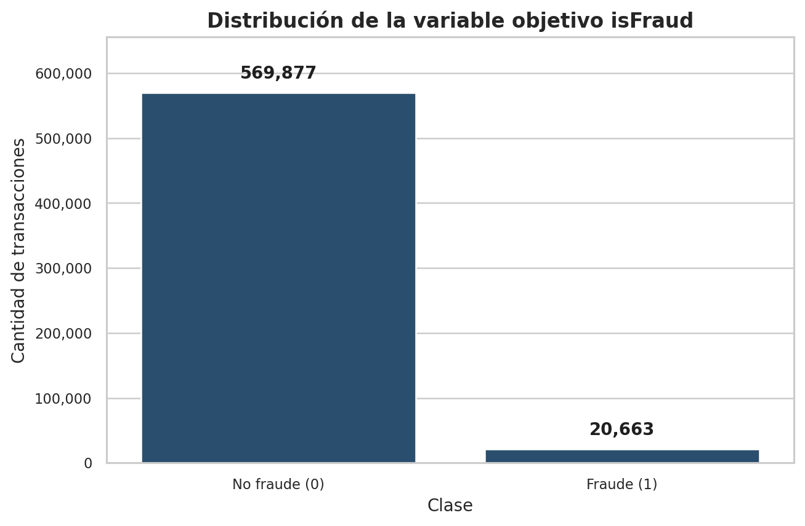
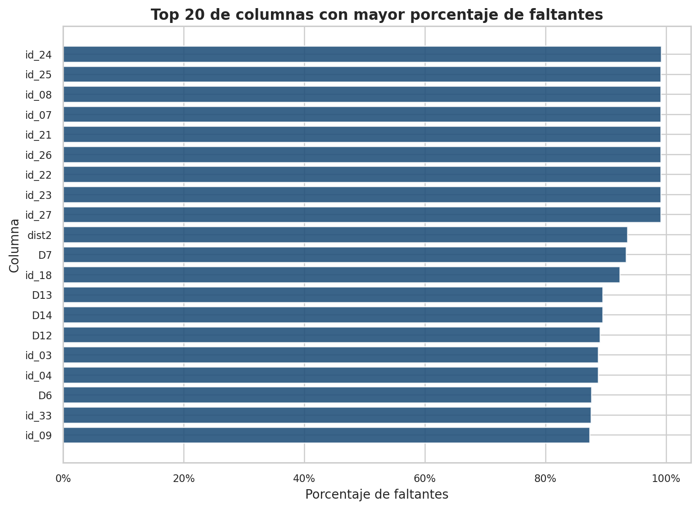
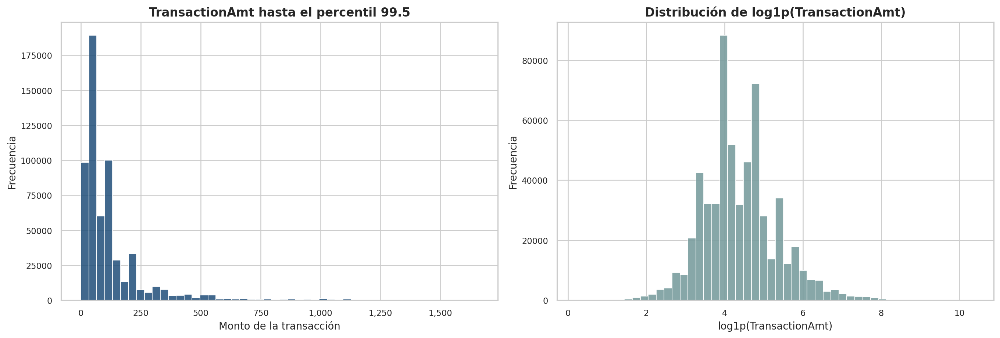
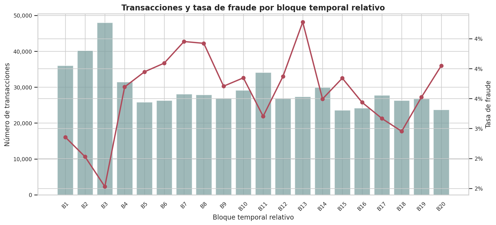
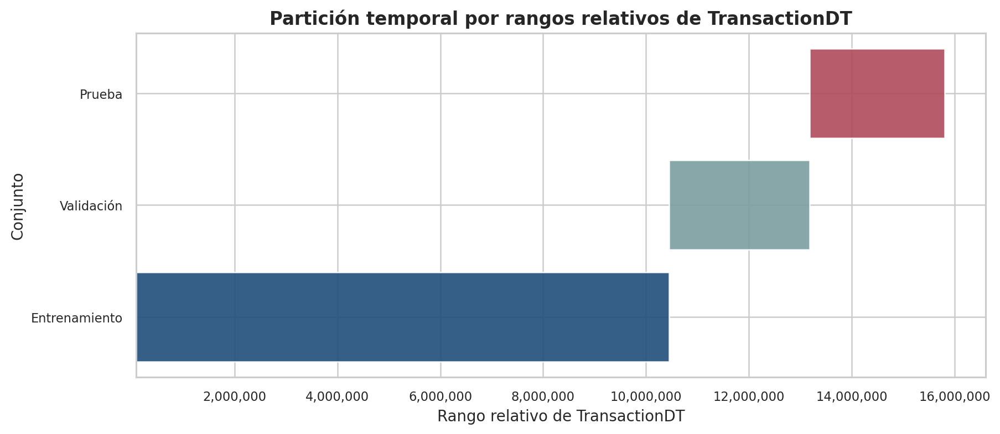
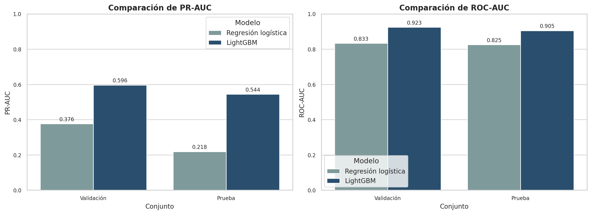
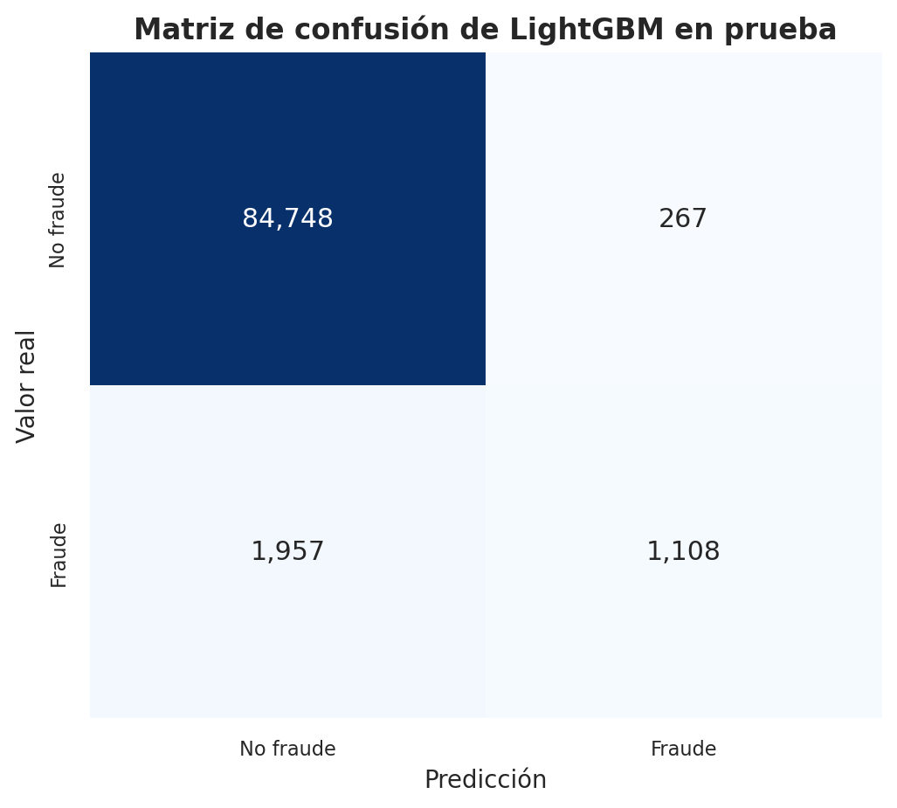
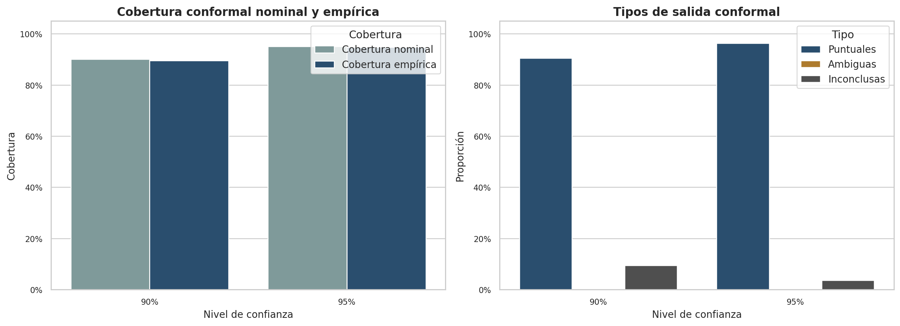
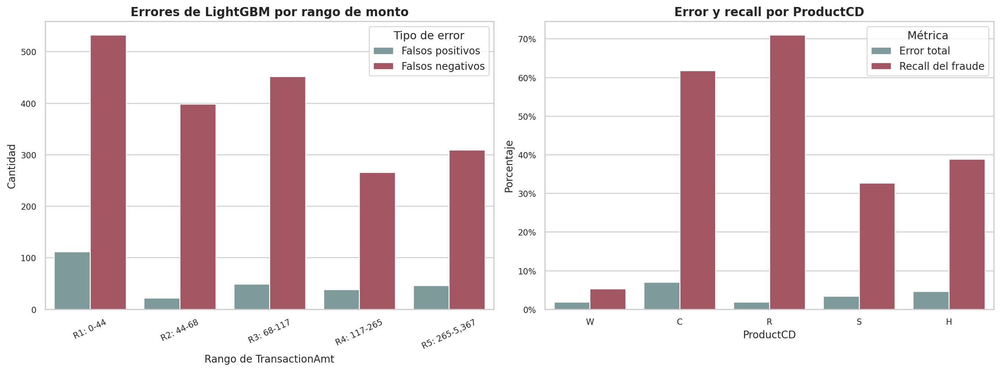

# Proyecto final: detección de fraude transaccional con aprendizaje automático

**Autor:** Fernando Corrales Quirós  
**Curso:** Fundamentos de Analítica de Datos  
**Institución:** Universidad CENFOTEC  
**Periodo:** Primer cuatrimestre, 2026  
**Dataset:** IEEE-CIS Fraud Detection

## 1. Propósito del documento

Este documento presenta la documentación técnica y metodológica del proyecto de detección de fraude transaccional desarrollado a partir del dataset IEEE-CIS Fraud Detection. Su finalidad es acompañar el notebook principal con una explicación ordenada de las decisiones analíticas, los resultados obtenidos y las principales conclusiones del trabajo.

La documentación está alineada con el notebook `notebooks/ieee_cis_fraud_detection_master.ipynb` y debe mantenerse sincronizada con él. Si el notebook cambia, también deben revisarse este documento, el resumen ejecutivo, el `README.md`, las figuras exportadas y los materiales locales de presentación cuando corresponda.

## 2. Contexto y objetivo del proyecto

La detección de fraude en transacciones digitales consiste en identificar operaciones con alta probabilidad de ser ilegítimas dentro de un flujo masivo de actividad comercial. Es un problema relevante porque el fraude genera pérdidas económicas, incrementa costos operativos, afecta la confianza de los usuarios y obliga a equilibrar dos riesgos: permitir una transacción fraudulenta o bloquear una transacción legítima.

El objetivo general del proyecto fue construir un flujo de ciencia de datos reproducible para analizar, preparar, modelar e interpretar el problema IEEE-CIS Fraud Detection. La solución no se limitó a entrenar un clasificador, sino que integró auditoría de datos, análisis exploratorio, partición temporal, preprocesamiento, comparación de modelos, explicabilidad, calibración, análisis de umbral, predicción conformal y análisis de errores.

## 3. Descripción del dataset

El dataset está formado por dos archivos principales:

- `train_transaction.csv`: contiene la información transaccional central, incluyendo `TransactionID`, `TransactionDT`, `TransactionAmt`, `ProductCD`, variables de tarjeta, variables derivadas y la variable objetivo `isFraud`.
- `train_identity.csv`: contiene información complementaria relacionada con identidad, dispositivo y atributos asociados a un subconjunto de transacciones.

La relación entre ambos archivos se realiza mediante `TransactionID`. En el notebook se utiliza `train_transaction` como tabla base y se incorpora `train_identity` mediante un `left join`, ya que no todas las transacciones tienen información de identidad. Esta decisión conserva el universo completo de transacciones supervisadas y agrega variables complementarias cuando están disponibles.

La variable objetivo es `isFraud`, donde `1` representa fraude y `0` no fraude. La variable `TransactionDT` se interpreta como un desplazamiento temporal relativo, no como una fecha calendario real.

## 4. Auditoría inicial del dataset unido

La auditoría inicial tuvo como propósito verificar la estructura del dataset antes de realizar análisis más complejos. Se revisaron dimensiones, tipos de datos, faltantes, distribución de la variable objetivo y consistencia de la unión entre tablas.

El dataset unido contiene 590,540 transacciones y 434 columnas. La proporción de fraude es reducida, lo que confirma un problema de clasificación desbalanceado. Este resultado condiciona toda la estrategia de evaluación: métricas como la exactitud pueden ser engañosas, por lo que se priorizan PR-AUC, ROC-AUC, precisión, recall, F1 y exactitud balanceada.

La auditoría también evidenció una presencia importante de valores faltantes, en especial en variables de identidad y en atributos derivados. Este hallazgo justificó una depuración inicial documentada y el uso de un pipeline de preprocesamiento capaz de tratar ausencias de forma reproducible.

## 5. Análisis exploratorio profundo

El análisis exploratorio profundizó en patrones comparativos entre fraude y no fraude. Se revisaron variables numéricas, variables categóricas interpretables y comportamiento temporal del fenómeno.

`TransactionAmt` mostró una distribución altamente asimétrica, con una cola larga. Para mejorar la lectura visual, el notebook utilizó una vista recortada hasta un percentil alto y una transformación `log1p(TransactionAmt)`. Esta doble visualización permite observar tanto el comportamiento típico de los montos como la dispersión extrema que se perdería en una escala lineal simple.

El análisis temporal mostró que la tasa de fraude cambia a lo largo de bloques relativos de `TransactionDT`. Esta variación respaldó la decisión de evitar una partición aleatoria pura y usar una partición basada en el orden temporal relativo.

También se estudiaron variables categóricas como `ProductCD`, `card4`, `card6`, dominios de correo y `DeviceType`. Un hallazgo importante fue que frecuencia y riesgo no son equivalentes: algunas categorías frecuentes pueden tener tasas de fraude moderadas, mientras que categorías menos frecuentes pueden mostrar señales proporcionalmente más fuertes.

## 6. Diseño metodológico y preprocesamiento

La partición de datos se construyó respetando el orden temporal relativo de `TransactionDT`. El dataset se dividió en entrenamiento, validación y prueba mediante cortes cronológicos. Esta estrategia reduce el riesgo de mezclar observaciones tempranas y recientes, lo cual podría sobreestimar el desempeño si existen cambios en los patrones transaccionales.

El preprocesamiento incluyó:

- Separación de la variable objetivo `isFraud`.
- Eliminación de columnas extremadamente incompletas, identificadores técnicos y variables sin variación.
- Identificación de variables numéricas y categóricas.
- Imputación numérica por mediana.
- Indicadores de ausencia en variables numéricas.
- Imputación categórica con una etiqueta explícita para faltantes.
- Codificación one-hot robusta ante categorías no vistas.

Todo el preprocesamiento se ajustó sobre entrenamiento y luego se aplicó a validación y prueba. Esta decisión es central para evitar fuga de información y mantener comparabilidad entre modelos.

## 7. Baseline interpretable

El baseline se construyó con dos referencias:

- `DummyClassifier`: modelo mínimo que reproduce la prevalencia de la clase objetivo sin aprender patrones.
- Regresión logística regularizada: modelo lineal interpretable que permite evaluar si el espacio transformado contiene señal predictiva.

La regresión logística superó claramente al `DummyClassifier`, lo que confirmó que las variables transformadas sí contienen información útil. Sin embargo, sus métricas centradas en fraude fueron limitadas. En particular, PR-AUC y recall mostraron que la recuperación de la clase positiva seguía siendo difícil, especialmente en prueba.

Este baseline fue importante porque estableció una referencia metodológica sobria. Cualquier modelo más complejo debía demostrar mejoras claras frente a esta línea base.

## 8. Modelo principal avanzado: LightGBM

LightGBM se seleccionó como modelo principal porque los problemas tabulares de fraude suelen contener relaciones no lineales, interacciones entre variables y patrones locales que un modelo lineal no captura con suficiente flexibilidad.

El modelo se entrenó con la misma partición temporal y el mismo preprocesamiento que el baseline, manteniendo comparabilidad metodológica. Los resultados mostraron una mejora clara frente a la regresión logística:

- PR-AUC en validación: de `0.3758` a `0.5960`.
- PR-AUC en prueba: de `0.2181` a `0.5440`.
- ROC-AUC en validación: de `0.8326` a `0.9235`.
- ROC-AUC en prueba: de `0.8249` a `0.9049`.

La matriz de confusión en prueba mostró que LightGBM recupera una parte importante del fraude, pero todavía deja una cantidad relevante de falsos negativos. Esto confirma que el modelo mejora el ranking y la detección, pero el problema sigue siendo complejo.

## 9. Explicabilidad, calibración y análisis de umbral

La evaluación del modelo principal no se limitó a métricas agregadas. Se incorporaron tres componentes para comprender mejor su comportamiento:

- SHAP, para explicar qué variables aportan más a las predicciones.
- Calibración isotónica, para evaluar la confiabilidad de las probabilidades.
- Análisis de umbral, para estudiar el intercambio entre precision, recall y F1.

SHAP mostró que variables transaccionales, temporales y agregados de comportamiento concentran una parte importante de la señal predictiva. Esta lectura mejora la trazabilidad del modelo, aunque no debe interpretarse como causalidad.

La calibración isotónica funcionó como diagnóstico de confiabilidad. Las probabilidades originales de LightGBM ya mostraban una alineación razonable en prueba, y la versión calibrada no mejoró de forma clara los indicadores resumidos.

El análisis de umbral mostró que el punto de corte `0.5` no debe asumirse automáticamente como óptimo. En el notebook, el umbral `0.25` aparece como un punto razonable bajo el criterio de maximizar F1 en validación, aunque la decisión final depende del costo relativo entre falsos positivos y falsos negativos.

## 10. Componente de incertidumbre: predicción conformal

La predicción conformal se incorporó para complementar las probabilidades del modelo con una medida de incertidumbre. En lugar de emitir únicamente una etiqueta o un score, el método produce conjuntos de predicción con cobertura empírica controlada.

Se evaluaron niveles nominales de `90%` y `95%` usando MAPIE. La cobertura global quedó cerca de los niveles nominales, pero la cobertura por clase fue desigual: no fraude quedó mucho mejor cubierto que fraude. Además, bajo la configuración aplicada, la incertidumbre apareció principalmente como abstención `{}` y no como ambigüedad `{0,1}`.

Este resultado es útil porque permite distinguir entre decisiones puntuales y casos donde el modelo no sostiene una etiqueta suficientemente confiable. En un contexto de fraude, esta señal puede orientar revisión manual o reglas operativas de cautela.

## 11. Análisis de errores y robustez

El análisis de errores permitió pasar de métricas globales a una lectura segmentada del comportamiento del modelo. En prueba, LightGBM obtuvo:

- 1,108 verdaderos positivos.
- 84,748 verdaderos negativos.
- 267 falsos positivos.
- 1,957 falsos negativos.

El costo principal del modelo está en los falsos negativos, es decir, transacciones fraudulentas que no fueron detectadas bajo el umbral estándar.

El análisis por rangos de `TransactionAmt`, bloques temporales, `ProductCD` y `DeviceType` mostró que el desempeño no es uniforme. Algunos segmentos presentan bajo error total, pero recall de fraude débil; otros muestran mayor error, pero mejor recuperación de fraude. Esta diferencia confirma que frecuencia, riesgo y calidad de detección deben analizarse de manera separada.

## 12. Conclusiones generales

El proyecto construyó un flujo completo y reproducible para detección de fraude transaccional. El EDA permitió identificar desbalance, faltantes, asimetría de montos y heterogeneidad temporal. El preprocesamiento y la partición temporal aportaron una base metodológica sólida para comparar modelos sin fuga de información.

LightGBM fue el modelo con mejor desempeño entre los evaluados y superó claramente a la regresión logística. Sin embargo, el análisis de errores mostró que el modelo conserva limitaciones importantes, especialmente en falsos negativos y variabilidad por segmentos.

SHAP aportó interpretabilidad, la calibración permitió evaluar confiabilidad probabilística, el análisis de umbral conectó el modelo con decisiones operativas y la predicción conformal añadió una lectura moderna de incertidumbre. En conjunto, el proyecto ofrece una evaluación amplia y prudente del problema, sin sobredimensionar el alcance del modelo.

## 13. Regla de mantenimiento documental

Toda modificación futura del notebook principal debe revisarse contra esta documentación. Si cambian resultados, secciones, métricas, gráficos, decisiones metodológicas o conclusiones, deben actualizarse también:

- `documentacion/md/documentacion_detallada.md`
- `documentacion/md/resumen_ejecutivo.md`
- el material local de presentación, cuando corresponda
- las versiones `.docx` públicas equivalentes en `documentacion/docx/`
- `README.md`
- las figuras en `reports/figures/` cuando corresponda

Esta regla mantiene la consistencia entre el análisis reproducible, la documentación formal y los materiales de presentación del proyecto.
